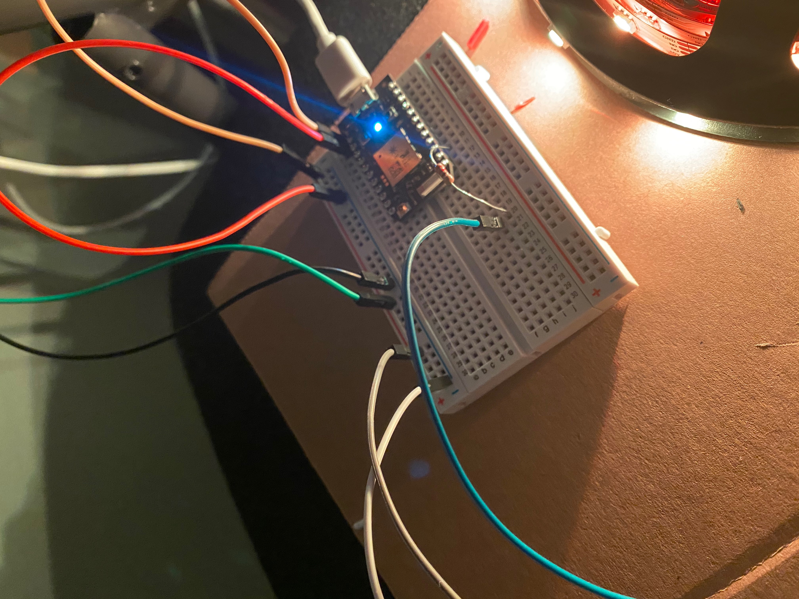
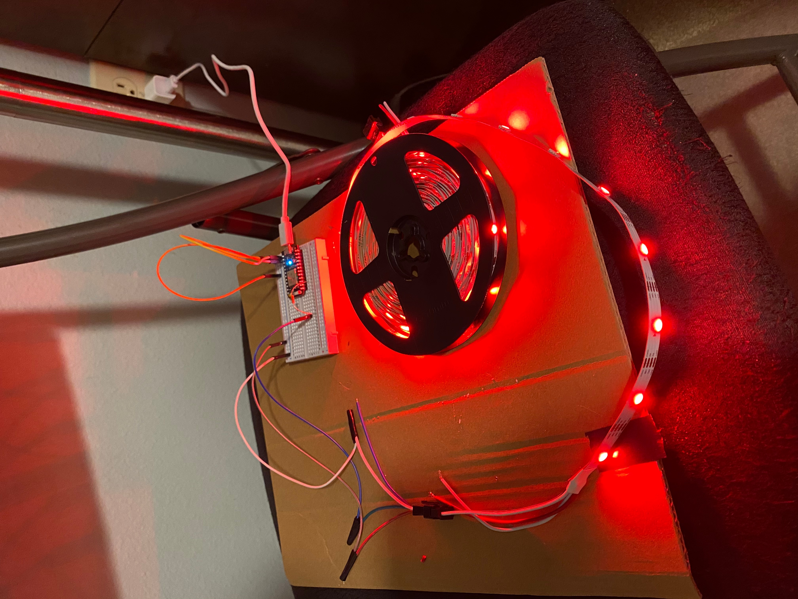
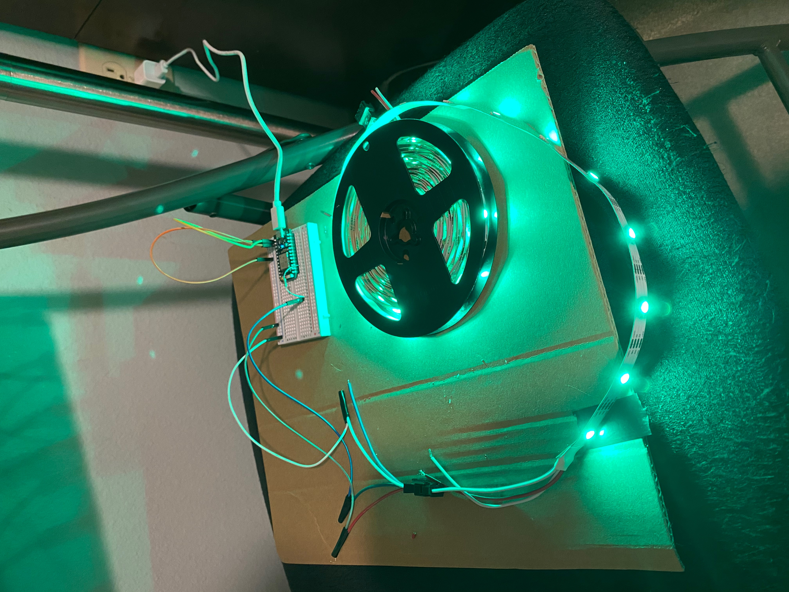

# Lights
Voice-Activated Lights using Amazon Echo, Particle Photon, and LED Strip
Used IFTTT and C++ code to voice-activate a WS2813 LED Strip connected to a particle photon.

Wiring:

Various options for color of lights:

